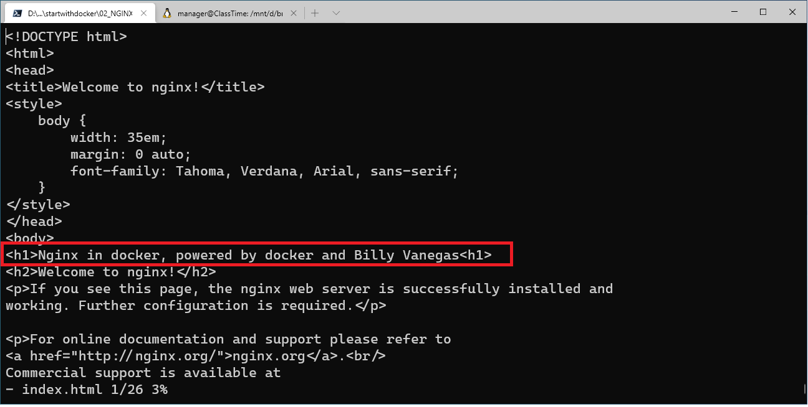

# Crear un contenedor con una imagen de NGINX

Creación de un contendor con NGINX

```
docker run -d --name nginx -p 8082:80 nginx:alpine
```

Navegar a este contenedor desde un browser http://localhost:8082


Conectate al servidor nginx con el commando:

	docker container exec -i -t nginx /bin/sh
Cambia la página web de inicio: 

``` 
cd /usr/share/nginx/html 
editar index.html
```



Abrir los puertos en el router:


Deshabilitar el firewall mientras la prueba para comprobar que sale a internet


Navegar a la ip publica con el puerto 8082


Habilite el firewall nuevamente (También puede crear una regla de inbound para este puerto si desea mantener la conexión)

